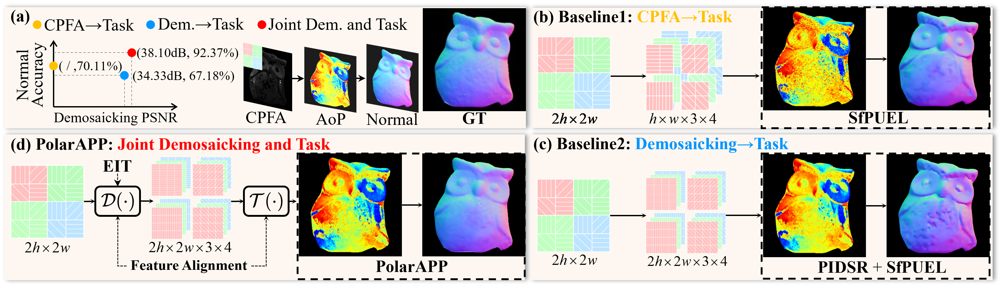
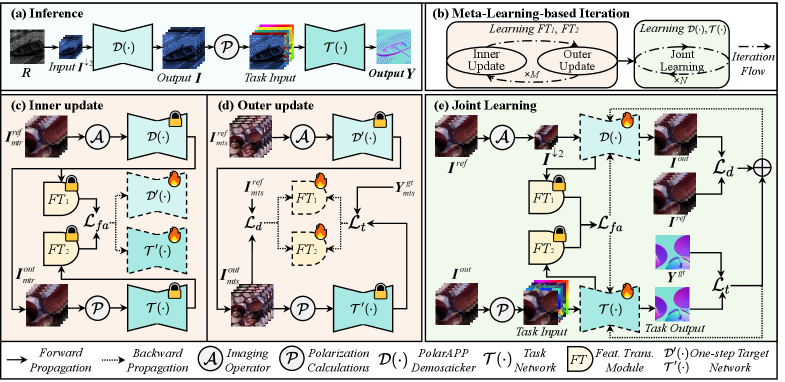

# PolarAPP: Beyond Polarization Demosaicking for Polarimetric Applications

<p align="center">
  <a href="https://arxiv.org/abs/2603.23071"></a>
  
  
</p>

Official implementation of **PolarAPP**, a task-aware framework that jointly
optimizes polarization demosaicking and downstream polarimetric applications.

<p align="center">
  
</p>

## Method

PolarAPP couples a full-resolution color-polarization demosaicker with a
task-specific network. Training has three stages:

1. meta-learn feature transforms so that feature alignment improves both
   reconstruction and downstream objectives;
2. jointly optimize the demosaicker and task network with reconstruction,
   task, feature-alignment, and equivalent-imaging losses;
3. freeze the demosaicker and refine the task network at the full inference
   resolution.

The feature transforms are used only during training, so they add no inference
cost.

<p align="center">
  
</p>

## Tasks

| Directory | Task | Downstream network |
| --- | --- | --- |
| [`SfP/`](./SfP) | surface-normal estimation from polarization | PolarAPP SfP TaskNet |
| [`DfP/`](./DfP) | reflection removal from polarization | PolarFree-based TaskNet |

Each task has an independent environment, configuration, dataset guide,
training entry point, inference entry point, and checkpoint layout. Start with
the README inside the task directory.

## Pretrained checkpoints

The official SfP and DfP checkpoints are hosted in the public Hugging Face
model repository [Roydon728/PolarAPP](https://huggingface.co/Roydon728/PolarAPP).

| Task | Hugging Face directory | `--ckpt-dir` after the download below |
| --- | --- | --- |
| SfP | [`SfP/`](https://huggingface.co/Roydon728/PolarAPP/tree/main/SfP) | `./pretrained/SfP` |
| DfP | [`DfP/`](https://huggingface.co/Roydon728/PolarAPP/tree/main/DfP) | `./pretrained/DfP` |

Download both tasks from the repository root:

```bash
python -c "from huggingface_hub import snapshot_download; snapshot_download('Roydon728/PolarAPP', allow_patterns=['SfP/*', 'DfP/*', 'SHA256SUMS.txt'], local_dir='./pretrained')"
```

Each task contains `DemNet/DemNet.pth`, `TaskNet/TaskNet.pth`, and
`FANet/FANet.pth`. File hashes are published in
[`SHA256SUMS.txt`](https://huggingface.co/Roydon728/PolarAPP/blob/main/SHA256SUMS.txt).
The DfP PolarFree diffusion-prior files follow the separate upstream download
instructions in [`DfP/experiments/checkpoints/README.md`](./DfP/experiments/checkpoints/README.md).

## Repository layout

```text
PolarAPP/
├── assets/                  # Paper figures used by this README
├── SfP/                     # Shape-from-polarization implementation
├── DfP/                     # De-reflection-from-polarization implementation
├── scripts/check_release.py # Detect accidental data/weight/path leakage
├── CITATION.cff
└── THIRD_PARTY_NOTICES.md
```

Datasets, pretrained weights, and experiment outputs are deliberately excluded
from Git. Download locations and expected layouts are documented in the task
READMEs.

## Quick start

### SfP

```bash
cd SfP
conda create -n polarapp-sfp python=3.10 -y
conda activate polarapp-sfp
# Install the PyTorch build matching your CUDA version first.
pip install -r requirements.txt
python -c "from huggingface_hub import snapshot_download; snapshot_download('Roydon728/PolarAPP', allow_patterns='SfP/*', local_dir='./experiments/checkpoints/huggingface')"
python infer.py --input-dir ./Datasets/Testsets \
  --ckpt-dir ./experiments/checkpoints/huggingface/SfP --device cuda:0
```

### DfP

```bash
cd DfP
conda create -n polarapp-dfp python=3.10 -y
conda activate polarapp-dfp
# Install the PyTorch build matching your CUDA version first.
pip install -r requirements.txt
python -c "from huggingface_hub import snapshot_download; snapshot_download('Roydon728/PolarAPP', allow_patterns='DfP/*', local_dir='./experiments/checkpoints/huggingface')"
python infer.py --input-dir ./Datasets/PolaRGB \
  --polarfree-checkpoint-dir ./experiments/checkpoints/polarfree \
  --ckpt-dir ./experiments/checkpoints/huggingface/DfP \
  --device cuda:0
```

## Data

| Resource | Source | Terms |
| --- | --- | --- |
| SfP training set | [SfPUEL training data](https://huggingface.co/datasets/Youwei2768/SfPUEL-training) | follow the dataset page |
| SfP evaluation set | [Google Drive](https://drive.google.com/file/d/1iHEjg90X2bOSkdt9uBCEd76SqzHj5pPC/view?usp=drive_link) | follow the original provider |
| DfP dataset | [PolaRGB](https://huggingface.co/datasets/Mingde/PolaRGB) | CC BY-NC 4.0 |
| SfP and DfP checkpoints | [Roydon728/PolarAPP](https://huggingface.co/Roydon728/PolarAPP) | see model card |

No dataset is redistributed by this repository.

## Reproducibility status

The source tree, configuration defaults, data-layout validation, inference,
evaluation, checkpoint discovery, release audit, smoke tests, and pretrained
checkpoints are available. Exact paper runs used Python 3.10, Adam with
learning rate `5e-5`, and NVIDIA RTX 4090 GPUs; task-specific weights are
documented in the corresponding configuration and README.

See [`VALIDATION.md`](./VALIDATION.md) for the release-candidate test record.

Before making the repository public, complete
[`RELEASE_CHECKLIST.md`](./RELEASE_CHECKLIST.md), especially the DfP third-party
redistribution permission and final project-license selection.

## Citation

```bibtex
@article{luo2026polarapp,
  title   = {PolarAPP: Beyond Polarization Demosaicking for Polarimetric Applications},
  author  = {Luo, Yidong and Li, Chenggong and Song, Yunfeng and Wang, Ping and Shi, Boxin and Zhang, Junchao and Yuan, Xin},
  journal = {arXiv preprint arXiv:2603.23071},
  year    = {2026}
}
```

## Acknowledgements

The DfP branch adopts PolarFree as its downstream task network. The SfP data
links originate from SfPUEL. See
[`THIRD_PARTY_NOTICES.md`](./THIRD_PARTY_NOTICES.md) for data attribution.
